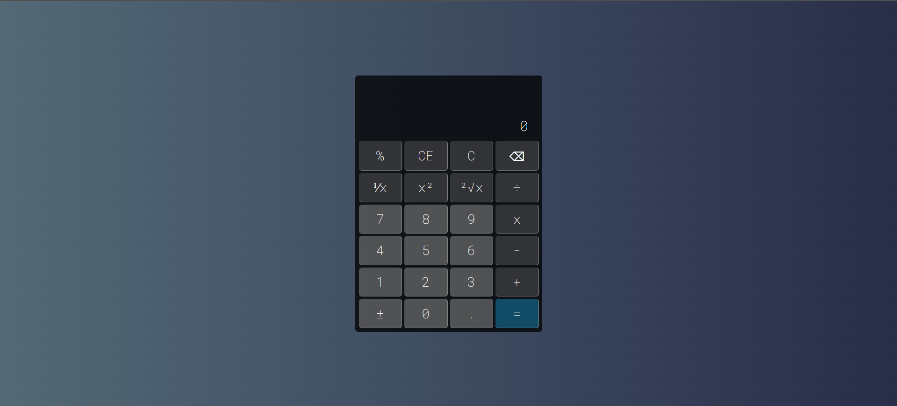

# Calculadora REACT

<div align="center">


<div data-badges>
 
 
 
 

</div>

<div data-badges>
 
 
 
 
 
</div>

</div>

## Descrição:

Esta calculadora é um aplicativo web simples e fácil de usar, construído com React. Ela permite que os usuários realizem operações aritméticas básicas, como adição, subtração, multiplicação e divisão. A calculadora possui uma interface limpa e intuitiva, com botões grandes e claros para facilitar a entrada de dados.

## Recursos:

Realiza operações aritméticas básicas (+, -, *, /)
Exibe o resultado em tempo real
Limpa o visor com um único clique


## Tecnologias:

- React
- HTML
- CSS
- JavaScript

## Contribuição:

Contribuições são bem-vindas! Se você encontrar algum bug ou tiver alguma sugestão de melhoria, sinta-se à vontade para abrir uma issue ou enviar um pull request. 

## Como rodar esse projeto

### Requisitos

- Node.js instalado

### Execução

1. Clone esse repositório

    ```sh
    git clone https://github.com/Pablo-Sts/calculator_react
    ```

2. Acesse o diretório do projeto: 

    ```sh
    cd calculator_react
    ```

3. Instale as dependênciads do projeto com o comando `npm i`.

4. Abra um terminal na pasta do projeto e execute o comando `npm run dev` para executar o projeto.

## Preview



## Links úteis

- [React JS](https://react.dev/)
- [HTML5](https://developer.mozilla.org/pt-BR/docs/Web/HTML)
- [CSS3](https://developer.mozilla.org/pt-BR/docs/Web/CSS)
- [Vite](https://vite.dev/)